  

 

## 👤 Hakkımda

Merhaba! Ben **Sinan**, Hatay/Türkiye merkezli bir **Backend Developer** stajyeriyim. Şu anda Fedora Linux üzerinde, VS Code + GitHub Copilot ile geliştirme yapıyorum.

- Şu an bir **MinIO S3 benchmark uygulaması** (Python ile depolama sistemi hız testi) üzerinde çalışıyorum
- Backend teknolojilerinde derinleşiyorum: Python, Spring, NestJS
- Geliştirici araçları (developer tooling) ve kişisel marka estetiğiyle (GitHub profili gibi) ilgileniyorum
- Linux ve konteynerleştirme (containerization – uygulamaları izole kutularda çalıştırma, örn. Docker) hakkında konuşmaktan keyif alırım

 

## ⚡ İlgi Alanları

| Alan | Açıklama |
|---|---|
| 🖥️ Linux | Fedora üzerinde günlük geliştirme ortamı |
| 🛠️ Developer Tooling | Verimliliği artıran araçlar ve iş akışları |
| 🎨 GitHub Estetiği | Profil README'leri, SVG animasyonlar |
| 📦 Backend Sistemleri | API'ler, depolama sistemleri, servis mimarisi |

 

## 🚀 Öne Çıkan Projeler

<table>
<tr>
<td width="50%">

### 📊 MinIO S3 Benchmark
Python ile yazılmış, MinIO (S3 uyumlu nesne depolama sistemi) için performans ölçüm (benchmark) aracı. Farklı yük senaryolarında okuma/yazma hızlarını test eder.

`Python` `MinIO` `S3` `Benchmarking`

</td>
<td width="50%">

### 🎬 Animasyonlu GitHub Profili
Saf SVG/SMIL (ek kütüphane gerektirmeyen, tarayıcı tarafından desteklenen animasyon standardı) kullanılarak yapılmış, cyber-terminal temalı profil sayfası.

`SVG` `SMIL` `Design`

</td>
</tr>
</table>

> Not: Buraya kendi öne çıkan projelerini (repo linkleriyle birlikte) ekleyebilirsin. İstersen `[Proje Adı](repo-linki)` formatında gerçek linklerini paylaş, birlikte dolduralım.

 

